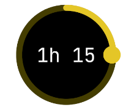

# Duration Picker for flutter

Fork from flutter_duration_picker. https://github.com/juliansteenbakker/duration_picker

This package introduces a compact and intuitive widget 🛠️ designed for selecting durations ⏳, drawing significant inspiration from the Material Design Time Picker ⌚. Tailored to enhance user experience 🌟, this widget seamlessly integrates into your Flutter applications 📱, providing a straightforward and efficient way for users to input time durations 🔄.




## Example Usage:

```dart
import 'package:duration_time_picker/duration_time_picker.dart';
import 'package:flutter/material.dart';

void main() => runApp(const MyApp());

class MyApp extends StatelessWidget {
  const MyApp({Key? key}) : super(key: key);

  @override
  Widget build(BuildContext context) {
    return MaterialApp(
      title: 'Duration Time Picker Demo',
      theme: ThemeData(
        primarySwatch: Colors.blue,
      ),
      home: const MyHomePage(title: 'Duration Time Picker Demo'),
    );
  }
}

class MyHomePage extends StatefulWidget {
  const MyHomePage({Key? key, required this.title}) : super(key: key);

  final String title;

  @override
  _MyHomePageState createState() => _MyHomePageState();
}

class _MyHomePageState extends State<MyHomePage> {
  Duration _durationMilli = Duration.zero;
  Duration _durationSecond = Duration.zero;
  Duration _durationMin = Duration.zero;
  Duration _durationHour = Duration.zero;

  @override
  Widget build(BuildContext context) {
    return Scaffold(
      appBar: AppBar(
        title: Text(widget.title),
      ),
      body: Center(
        child: GridView(
          gridDelegate:
              SliverGridDelegateWithFixedCrossAxisCount(crossAxisCount: 2),
          children: [
            DurationTimePicker(
              duration: _durationMilli,
              baseUnit: BaseUnit.millisecond,
              circleColor: Colors.grey.withOpacity(0.5),
              progressColor: Colors.blue.withOpacity(1),
              onChange: (val) {
                setState(
                  () => _durationMilli = val,
                );
              },
            ),
            DurationTimePicker(
              duration: _durationSecond,
              baseUnit: BaseUnit.second,
              progressColor: Colors.amber,
              onChange: (val) {
                setState(
                  () => _durationSecond = val,
                );
              },
            ),
            DurationTimePicker(
              duration: _durationMin,
              baseUnit: BaseUnit.minute,
              circleColor: Colors.pink,
              onChange: (val) {
                setState(
                  () => _durationMin = val,
                );
              },
            ),
            DurationTimePicker(
              duration: _durationHour,
              baseUnit: BaseUnit.hour,
              onChange: (val) {
                setState(
                  () => _durationHour = val,
                );
              },
            )
          ],
        ),
      ),
    );
  }
}


```

